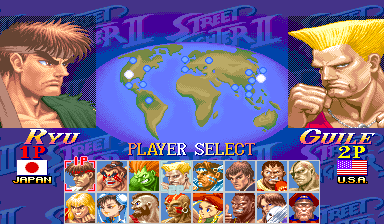

# SuperTurboAltColors
An alternative color set for Super Street Fighter 2: Turbo

## Getting Started
This will get you playing Super Turbo on your local machine with new colors for all characters.

### Prerequisites
 * [Fightcade](http://www.fightcade.com/)
 * The roms for ssf2t.zip and ssf2xj.zip. You need to get these on your own.
 
### Installing
Download the latest release:
 * [Latest release 2020-05-19](roms/2020-05-19-fightcade-ssf2xj.zip?raw=true)
 
* The 2020-05-19-fightcade-ssf2xj.zip folder contains 3 files, named sfxj.03c, sfxj.04a, and sfxj.06a
* Open your fightcade roms folder. Inside it is a file called ssf2xj.zip.
* Drag the three files into ssf2xj.zip. It will replace three existing files.
* Open fightcade. You should see the new colors on the select screen

 

Do not use a save state to load, as that will show the old colors.
